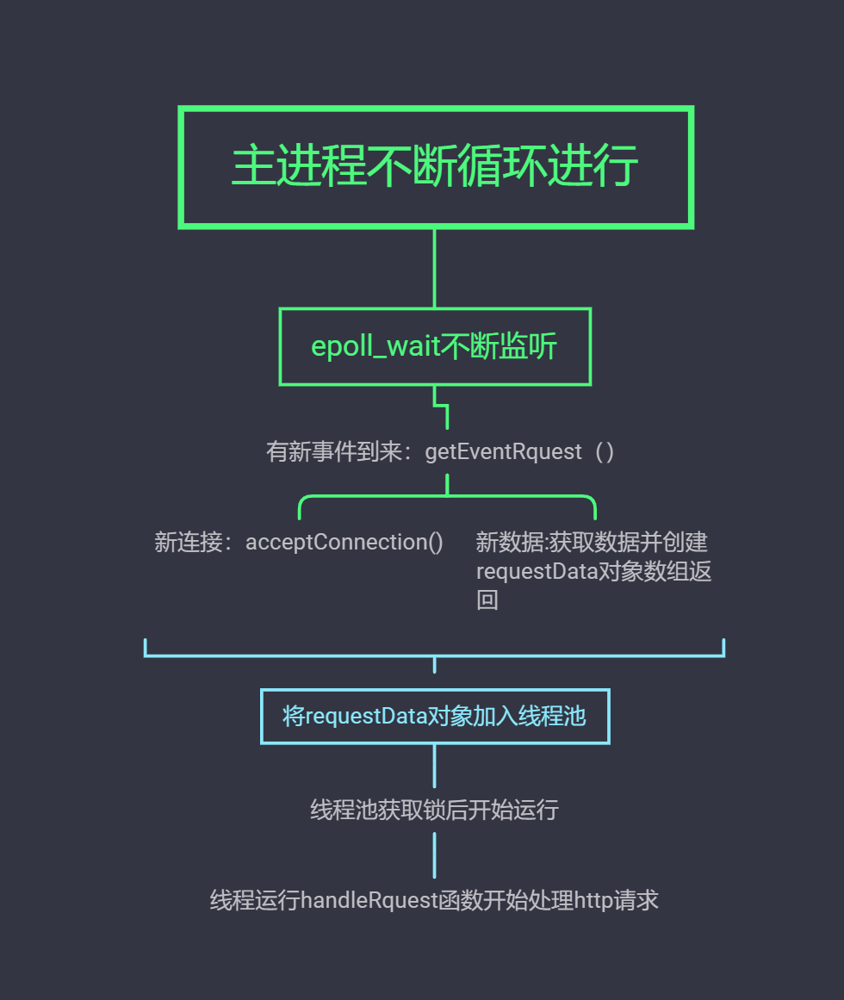

# My_first_WebServer
基于c++及linux网络编程的web服务器

该web服务器的主要内容如下：

* 使用了epoll边沿触发+EPOLLONESHOT+非阻塞IO

* 使用了一个固定线程数的线程池

* 实现了一个任务队列，由条件变量触发通知新任务的到来

* 实现了一个小根堆的定时器及时剔除超时请求，使用了STL的优先队列来管理定时器

* 解析了HTTP的get、post请求，支持长短连接

* 线程的工作分配为：

  * 主线程负责等待epoll中的事件，并把到来的事件放进任务队列，在每次循环的结束剔除超时请求和被置为删除的时间结点
  * 工作线程阻塞在条件变量的等待中，新任务到来后，某一工作线程会被唤醒，执行具体的IO操作和计算任务，如果需要继续监听，会添加到epoll中  

* 锁的使用有两处：

  * 第一处是任务队列的添加和取操作，都需要加锁，并配合条件变量，跨越了多个线程。

  * 第二处是定时器结点的添加和删除，需要加锁，主线程和工作线程都要操作定时器队列。

    

- 几乎所有的指针采用智能指针
- 对于时间结点和HTTP类互指问题，采用weak_ptr解决

图解如下：

